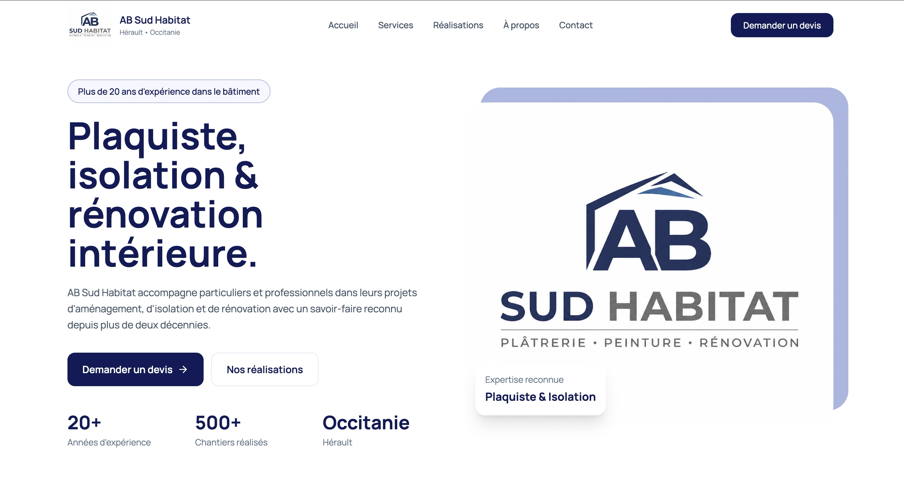
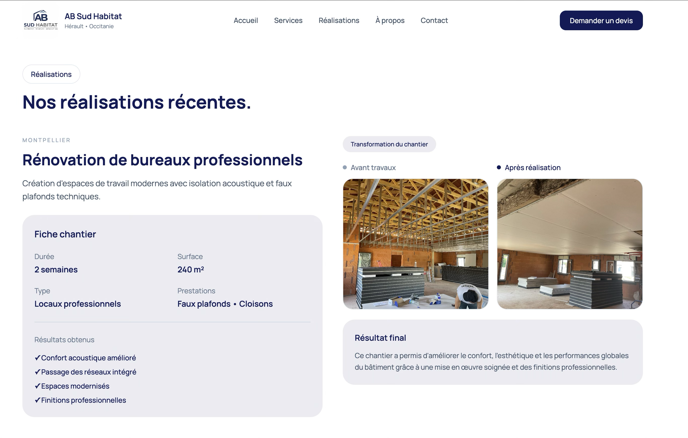
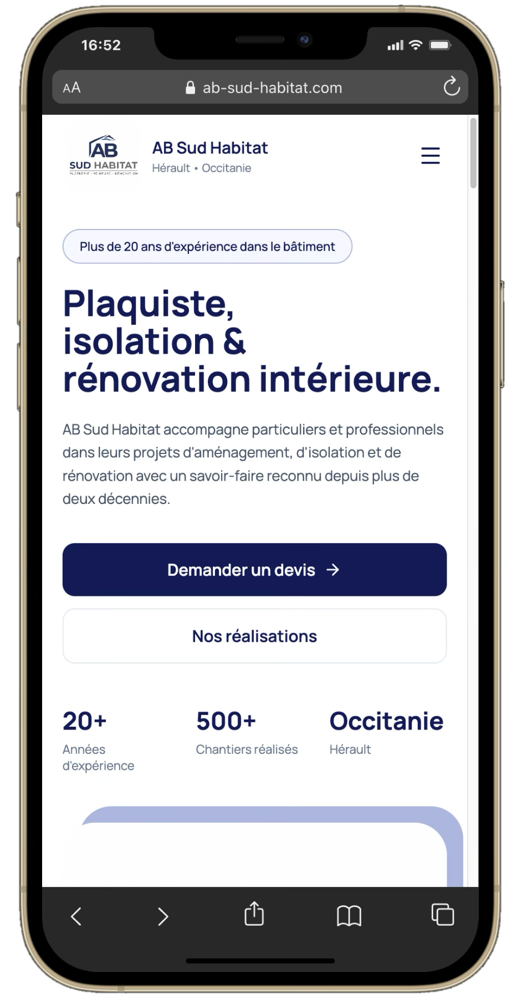
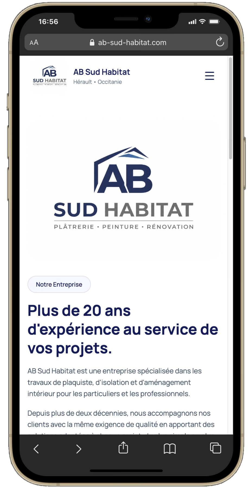

# AB Sud Habitat

### Description

Site vitrine développé pour AB Sud Habitat, une entreprise spécialisée dans les travaux de plâtrerie, cloisons, isolation, faux plafonds, peinture et rénovation en Occitanie. Ce projet a été conçu afin d’offrir une présence en ligne moderne à l’entreprise et de permettre aux particuliers comme aux professionnels de découvrir ses prestations, ses réalisations récentes et de demander un devis gratuitement. Le site met en avant l’expertise de l’entreprise à travers différentes sections dédiées aux services proposés, aux réalisations récentes ainsi qu’aux informations de contact.

**[Visiter le site](https://ab-sud-habitat.com/)**

### Aperçu web

  
  

### Fonctionnalités

- Présentation des prestations
- Galerie de réalisations
- Pages dédiées aux cloisons, isolation et faux plafonds
- Formulaire de demande de devis
- Design responsive
- Mentions légales et politique de confidentialité
- Optimisation SEO de base

### Technologies

`React` · `TypeScript` · `Tailwind CSS` · `Framer Motion` · `Vite` · `Lenis` · `React Router`

### Aperçu mobile

  
  

